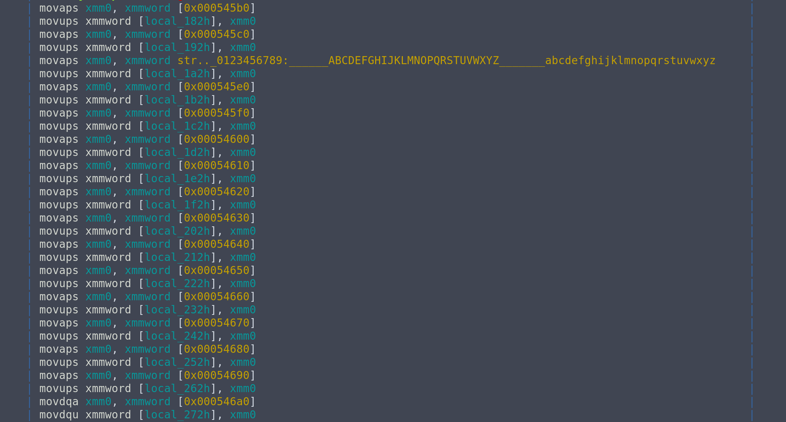
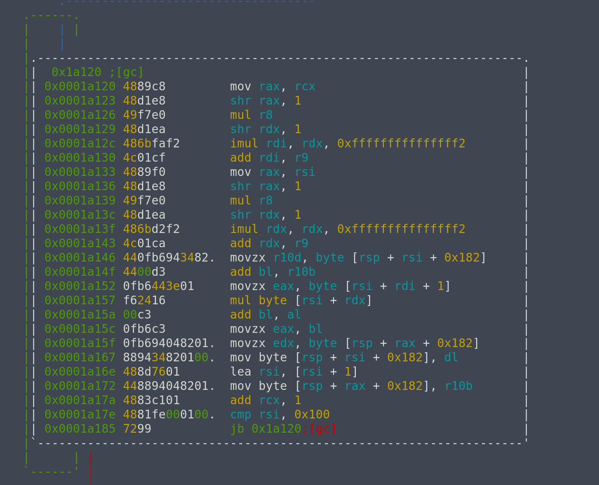
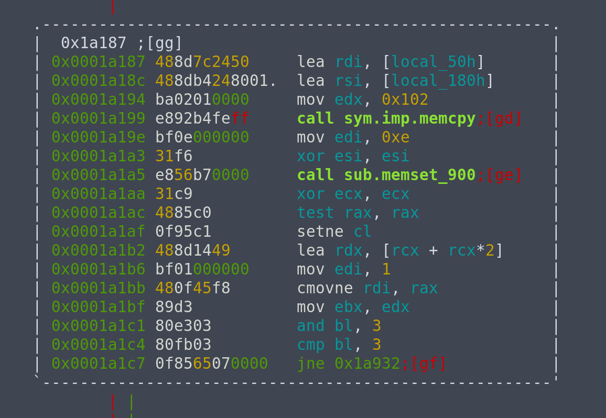
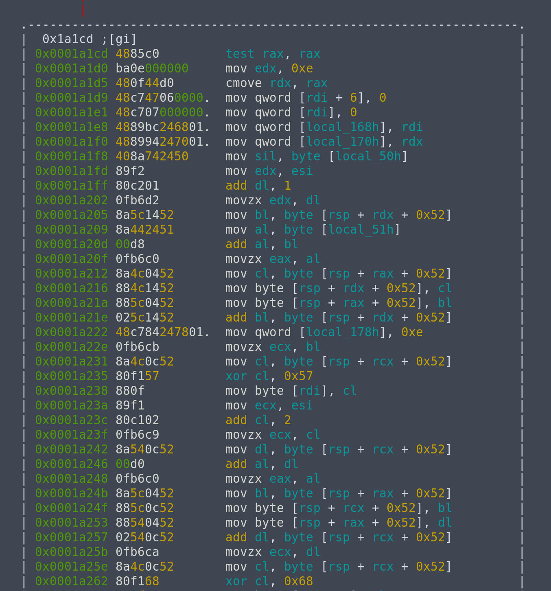

# CrossCTF Finals 2018 : Rochefort 8 (re)

> Decrypt the encrypted flag!
> 
> Creator - quanyang (@quanyang)
>
> [iamrusty](./iamrusty)
> 
> The encrypted flag is [193, 43, 110, 37, 49, 203, 177, 168, 213, 56, 111, 114, 136, 234, 91, 129, 74, 3, 134, 159, 134, 47, 53, 245, 103, 247, 251, 52, 198, 245, 208, 139, 188, 151, 208, 36, 109, 245, 48, 174, 123, 154]

## Summary

We are given a stripped binary, which name suggests to be a Rust binary. Reversing it, we see that it performs some form of variation of RC4, and we will use it to decrypt our flag.

The steps taken to reverse this binary are:

- [Apply zignatures](#apply-zigs)
- [Find `main`](#find-main)
- [Reverse encryption algorithm](#reverse-encryption)
- [Decrypt the flag](#solution)

## Analysis

For this challenge, I used r2 as I am more familiar with it compared to IDA. Like usual, start by running `file` on the binary and executing it to see what it is about.

```bash
$ file iamrusty 
iamrusty: ELF 64-bit LSB pie executable x86-64, version 1 (SYSV), statically linked, stripped
$ ./iamrusty   
[1]    28689 segmentation fault  ./iamrusty
```

We see that it is a statically linked, stripped binary. Weirdly, it crashes.

Anyways, load the binary in analysis mode in r2.

```bash
$ r2 -A iamrusty
```

Then, use `afl` to check the functions.

```
[0x0012be40]> afl
0x0012be40    3 50           entry0
0x0012be72    7 62           fcn.0012be72
0x0012beb0   20 164          fcn.0012beb0
0x0012c01c    9 17   -> 124  fcn.0012c01c
0x0012c02d   15 107  -> 228  fcn.0012c02d
0x0012c098    1 34           fcn.0012c098
```

We see only 6 functions. There are a few possible reasons to this:

- The binary is statically linked and uses very minimal amount of library functions
- The binary is written by hand
- The binary is packed

Looking into `entry0`, we see


We see some initialization and `call fcn.0012beb0`. Peeking into it in graph view, we see a rather complicated graph, and non-typical instructions like `call r11`. This eliminates the possiblity that it is hand-written assembly. It is also unlikely to be the first case, as normally there would be a `__libc_start_main` function call at the start.

Hence, we should explore the possibility that it is packed. Using `strings` on the binary, we see `UPX!` on the first line. Ah, it is a UPX packed binary. We can unpack it to analyse it.

```bash
$ upx -d iamrusty -o unpacked
```

Now, running `file` again and executing the binary.

```bash
$ file unpacked
unpacked: ELF 64-bit LSB pie executable x86-64, version 1 (SYSV), dynamically linked, interpreter /lib64/ld-linux-x86-64.so.2, for GNU/Linux 2.6.24, BuildID[sha1]=6d25298b54bfbbf751f73e6e0833e24961702770, stripped
$ ./unpacked
The encrypted flag is [213, 49, 96, 34, 11, 251, 177, 134, 203, 44, 118, 96, 155, 172]
```

Now this makes more sense. Let's also run `strings` on it. Doing so, we see strings like "jemalloc" or strings contaning "rs". So, we can confirm that this is a Rust binary.

### Apply zigs
Before starting to analyse the binary, since it is stripped, this means it will be very difficult to know what each function does. I made use of [zignatures](http://radare.today/posts/zignatures/) to try to identify each function. The radare2 book has a more detailed [documentation](https://radare.gitbooks.io/radare2book/content/signatures/zignatures.html) of the zignatures namespace.

I prepared a [zignature file](https://github.com/daniellimws/REsources/blob/master/zigs/rust/rust.z) which contains the signatures of most commonly used Rust standard library functions.

To do this, don't load the binary in analysis mode, just plain `r2 ./unpacked`. Then, load the zignature file, apply it to our binary, and only after that use `aaa` to analyse it.

```bash
[0x00006c01]> zo /home/daniel/REsources/zigs/rust/rust.z 
[0x00006c01]> z/
[+] searching 0x00000000 - 0x00063794
0x0000cb20 Sequencial hit ignored.
0x0000cb60 Sequencial hit ignored.
0x0000cb20 Sequencial hit ignored.
0x0000cb60 Sequencial hit ignored.
0x0000cb20 Sequencial hit ignored.
0x0000cb60 Sequencial hit ignored.
0x0000cb20 Sequencial hit ignored.
0x0000cb60 Sequencial hit ignored.
0x0000cb20 Sequencial hit ignored.
0x0000cb60 Sequencial hit ignored.
0x00014240 Sequencial hit ignored.
0x00014240 Sequencial hit ignored.
0x00014240 Sequencial hit ignored.
0x00014240 Sequencial hit ignored.
0x00014240 Sequencial hit ignored.
0x00014240 Sequencial hit ignored.
0x00015b00 Sequencial hit ignored.
0x00015b00 Sequencial hit ignored.
0x00017780 Sequencial hit ignored.
0x00017780 Sequencial hit ignored.
0x00017780 Sequencial hit ignored.
0x00017780 Sequencial hit ignored.
0x00017780 Sequencial hit ignored.
[+] searching 0x00263900 - 0x002683b8
[+] searching function metrics
hits: 206
[0x00006c01]> aaa
[x] Analyze all flags starting with sym. and entry0 (aa)
[x] Analyze len bytes of instructions for references (aar)
[ WARNING : block size exceeding max block size at 0x0000d7a0
[+] Try changing it with e anal.bb.maxsize
[x] Analyze function calls (aac)
[x] Use -AA or aaaa to perform additional experimental analysis.
[x] Constructing a function name for fcn.* and sym.func.* functions (aan)
```

It is not perfect. It will not successfully label every single function in there, but it was really helpful in identifying functions like

```c
sign.bytes.sym.core::fmt::Write::write_fmt::hda0de9044a822dbe_2
sign.bytes.sym.core::fmt::Formatter::pad_integral::__u7b__u7b_closure_u7d__u7d_::h405811ed46957e23_0
```

which helped a lot in guessing what a function does.

### Find main

One major problem with this being a stripped binary means we don't know where `main` is, and it is not as obvious as typical C binaries. 

Typically, for C binaries, the program will enter `main` after the call of `__libc_start_main`. However, for Rust, after `__libc_start_main`, the program does **a lot** of setting up, before going into the actual `main`. 

And since it is a stripped binary, we won't know which function call is `main` or for setting up!

#### Useful pattern

However, I am not completely stuck. From trying to reverse different simple Rust binaries I compiled myself, I noticed a very helpful pattern. It turns out that regardless of whatever or however much set up is being done at the start, before executing the actual `main`, Rust will execute the following instruction block.

```asm
jmp QWORD PTR [rsi + 0x18]
... # a few instructions
call QWORD [rdi]
```

There will always be a `jmp` to `[rsi + 0x18]`, and after a few instructions that may differ depending on the binary, it will `call QWORD [rdi]`, bringing us into the real `main`.

#### Using backtrace

Now that we have an idea of what to look for, we can further narrow down our search space by making use of the backtrace at the point where the program prints the encrypted flag. This is because the printing must be called inside `main`, so the address of an instruction that calls `main` will be inside the backtrace for sure.

For this part, I used GEF. To add a breakpoint when the encrypted is being printed, we can set a catchpoint at a `write` syscall.

```bash
gef➤  catch syscall write
```

Then use `r` to start executing the binary, and `bt` to view the backtrace.

```bash
gef➤  bt
#0  0x00007ffff7f7f291 in __libc_write (fd=0x1, buf=0x7ffff761c000, nbytes=0x57) at ../sysdeps/unix/sysv/linux/write.c:27
#1  0x0000555555560e9c in ?? ()
#2  0x0000555555562278 in ?? ()
#3  0x0000555555561568 in ?? ()
#4  0x000055555556a0f6 in ?? ()
#5  0x00005555555625db in ?? ()
#6  0x000055555556e696 in ?? ()
#7  0x000055555556eb43 in ?? ()
#8  0x000055555556ddb3 in ?? ()
#9  0x00007ffff7bbbb17 in __libc_start_main (main=0x55555556d7a0, argc=0x1, argv=0x7fffffffde68, init=<optimized out>, fini=<optimized out>, rtld_fini=<optimized out>, stack_end=0x7fffffffde58) at ../csu/libc-start.c:310
#10 0x000055555555ac2a in ?? ()
```

No shortcuts here. We can start by looking at the function called after `__libc_start_main`, which is at #8. Because the addresses here are added with a base address, we can use `vmmap` to get the base address, which is `0x0000555555554000`. Subtracting it from the address at #8, we can inspect it in r2, at address `0x19db3`.


We see that before this instruction, `call fcn.000079b0` was being executed, so #7 is an address inside `fcn.000079b0`. Let's try to set a breakpoint at `0x19dae` and see if we can find the `jmp [rsi+0x18]` instruction from here. 

Since the binary is a PIE, we can't set the breakpoint at `0x19dae` using `break *0x19dae`, since during execution there will be a base address added to it as seen earlier, and `0x19dae` will become an invalid address.

To do this, we can use `pie break *0x19dae` from gef, and `pie run` to run it with these settings.


Great! `jmp [rsi+0x18]` is close to us. Single stepping a few steps, we arrive at `call [rdi]`, which brings us into the actual program `main`, which is at `0x55555556dff0`, without the base address it is `0x19ff0`.

#### Define function in r2

Now we are left with defining `0x19ff0` as a function in r2, and renaming it to `actual_main`. We can do this by seeking `0x19ff0` using `s 0x19ff0`, then entering visual mode using `V`, and pressing `df` to define function, lastly `dr` to rename function.

Once we are done with this, we can open up the graph view and actually start to reverse what the binary is doing.

#### rust-main-break

Since I do not want to do this kind of searching all the time, I wrote a command for [`gef-extras`](https://github.com/daniellimws/gef-extras/blob/rust-main-break/scripts/rustbreak.py) that automates this process. It will look like something like the following

```bash
gef➤  rust-main-break
[+] Breaking at '{<text variable, no debug info>} 0x5570 <__libc_start_main@plt>'
[Thread debugging using libthread_db enabled]
Using host libthread_db library "/lib/x86_64-linux-gnu/libthread_db.so.1".
[+] Searching for 'jmp QWORD PTR [rsi + 0x18]' instructions
[+] Trying 0x55555555b9b5
[Thread debugging using libthread_db enabled]
Using host libthread_db library "/lib/x86_64-linux-gnu/libthread_db.so.1".
0x000055555556eb40 in ?? ()
0x000055555556eb41 in ?? ()
─────────────────────────────────────────────────────────────────────────────────────────────────────────────────────────────────────────────────────────────────────────────────────────────────────────────────[ registers ]────
$rax   : 0x0               
$rbx   : 0x5555557bb2c8      →  0x0000000000000000
$rcx   : 0x0               
$rdx   : 0x5555557bb2c8      →  0x0000000000000000
$rsp   : 0x7fffffffdc28      →  0x000055555556eb43  →   xor eax, eax
$rbp   : 0x7ffff7625000      →  0x0000000000000001
$rsi   : 0x5555557baae8      →  0x000055555556eb30  →   ret 
$rdi   : 0x7fffffffdcb8      →  0x000055555556dff0  →   push r14
$rip   : 0x55555556dff0      →   push r14
$r8    : 0x0               
$r9    : 0x800000000       
$r10   : 0xf               
$r11   : 0x7ffff7fe7990      →  <_dl_find_dso_for_object+0> push r13
$r12   : 0x7fffff7fe000    
$r13   : 0x1               
$r14   : 0x7fffffffdc40      →  0x0000000000000001
$r15   : 0x7fffff7ff000    
$eflags: [ZERO carry PARITY adjust sign trap INTERRUPT direction overflow resume virtualx86 identification]
$fs: 0x0000  $gs: 0x0000  $es: 0x0000  $ds: 0x0000  $cs: 0x0033  $ss: 0x002b  
─────────────────────────────────────────────────────────────────────────────────────────────────────────────────────────────────────────────────────────────────────────────────────────────────────────────────────[ stack ]────
0x00007fffffffdc28│+0x00: 0x000055555556eb43  →   xor eax, eax	 ← $rsp
0x00007fffffffdc30│+0x08: 0x0000000000000000
0x00007fffffffdc38│+0x10: 0x000055555556ddb3  →   mov ebx, eax
0x00007fffffffdc40│+0x18: 0x0000000000000001	 ← $r14
0x00007fffffffdc48│+0x20: 0x00007fffff7fe000
0x00007fffffffdc50│+0x28: 0x00007fffff7ff000
0x00007fffffffdc58│+0x30: 0x00007ffff7625000  →  0x0000000000000001
0x00007fffffffdc60│+0x38: 0x00007fffffffde78  →  0x00007fffffffe205  →  "XDG_RUNTIME_DIR=/run/user/1000"
──────────────────────────────────────────────────────────────────────────────────────────────────────────────────────────────────────────────────────────────────────────────────────────────────────────[ code:i386:x86-64 ]────
   0x55555556dfe0                  ud2    
   0x55555556dfe2                  nop    WORD PTR cs:[rax+rax*1+0x0]
   0x55555556dfec                  nop    DWORD PTR [rax+0x0]
 → 0x55555556dff0                  push   r14
   0x55555556dff2                  push   rbx
   0x55555556dff3                  sub    rsp, 0x298
   0x55555556dffa                  lea    rdi, [rsp+0x180]
   0x55555556e002                  xor    ebx, ebx
   0x55555556e004                  xor    esi, esi
───────────────────────────────────────────────────────────────────────────────────────────────────────────────────────────────────────────────────────────────────────────────────────────────────────────────────[ threads ]────
[#0] Id 1, Name: "unpacked", stopped, reason: SINGLE STEP
─────────────────────────────────────────────────────────────────────────────────────────────────────────────────────────────────────────────────────────────────────────────────────────────────────────────────────[ trace ]────
[#0] 0x55555556dff0 → push r14
[#1] 0x55555556eb43 → xor eax, eax
[#2] 0x55555556ddb3 → mov ebx, eax
[#3] 0x7ffff7bbbb17 → Name: __libc_start_main(main=0x55555556d7a0, argc=0x1, argv=0x7fffffffde68, init=<optimized out>, fini=<optimized out>, rtld_fini=<optimized out>, stack_end=0x7fffffffde58)
[#4] 0x55555555ac2a → hlt 
──────────────────────────────────────────────────────────────────────────────────────────────────────────────────────────────────────────────────────────────────────────────────────────────────────────────────────────────────
0x000055555556dff0 in ?? ()
[+] Found 'main' at 0x55555556dff0
```

### Reverse encryption

Now that we can analyse `main`, the next step is to reverse the encryption algorithm. At the start of the function, we see a few blocks of data are being copied to the stack.  



Inspecting those values,

```bash
:> ps @ 0x545b0
\x01\x02\x03\x04\x05\x06\x07\x08\x09
\x0b\x0c\x0d\x0e\x0f\x10\x11\x12\x13\x14\x15\x16\x17\x18\x19\x1a\x1b\x1c\x1d\x1e\x1f !"#$%&'()*+,-./0123456789:;<=>?@ABCDEFGHIJKLMNOPQRSTUVWXYZ[\]^_`abcdefghijklmnopqrstuvwxyz{|}~\x7f\x80\x81\x82\x83\x84\x85\x86\x87\x88\x89\x8a\x8b\x8c\x8d\x8e\x8f\x90\x91\x92\x93\x94\x95\x96\x97\x98\x99\x9a\x9b\x9c\x9d\x9e\x9f\xa0\xa1\xa2\xa3\xa4\xa5\xa6\xa7\xa8\xa9\xaa\xab\xac\xad\xae\xaf\xb0\xb1\xb2\xb3\xb4\xb5\xb6\xb7\xb8\xb9\xba\xbb\xbc\xbd\xbe\xbf\xc0\xc1\xc2\xc3\xc4\xc5\xc6\xc7\xc8\xc9\xca\xcb\xcc\xcd\xce\xcf\xd0\xd1\xd2\xd3\xd4\xd5\xd6\xd7\xd8\xd9\xda\xdb\xdc\xdd\xde\xdf\xe0\xe1\xe2\xe3\xe4\xe5\xe6\xe7\xe8\xe9\xea\xeb\xec\xed\xee\xef\xf0\xf1\xf2\xf3\xf4\xf5\xf6\xf7\xf8\xf9\xfa\xfb\xfc\xfd\xfe\xff
```

it looks like the initial permutation of [RC4](https://en.wikipedia.org/wiki/RC4). It's something important to keep in mind, but not to quickly jump to conclusions yet.

(Actually, a hint was given that the encryption method is a variation of RC4)

#### Output tracing

At this point, what I decided to do, was to try to trace the output of the program, to see what is being done to it, and where did it come from. Again, I made use of the backtrace.

(For reference)

```bash
gef➤  bt
#0  0x00007ffff7f7f291 in __libc_write (fd=0x1, buf=0x7ffff761c000, nbytes=0x57) at ../sysdeps/unix/sysv/linux/write.c:27
#1  0x0000555555560e9c in ?? ()
#2  0x0000555555562278 in ?? ()
#3  0x0000555555561568 in ?? ()
#4  0x000055555556a0f6 in ?? ()
#5  0x00005555555625db in ?? ()
#6  0x000055555556e696 in ?? ()
#7  0x000055555556eb43 in ?? ()
#8  0x000055555556ddb3 in ?? ()
#9  0x00007ffff7bbbb17 in __libc_start_main (main=0x55555556d7a0, argc=0x1, argv=0x7fffffffde68, init=<optimized out>, fini=<optimized out>, rtld_fini=<optimized out>, stack_end=0x7fffffffde58) at ../csu/libc-start.c:310
#10 0x000055555555ac2a in ?? ()
```

This time, we want to find the address of the instruction in `actual_main` that calls a function that leads to printing the encrypted flag. After some checking, #6 is the one we are looking for. 

In particular, `call fcn.0000e520` at `0x1a691`.


Now, the question is, is `fcn.0000e520` a printing function, or a function that further encrypts the flag then calls a printing function? To do this, we can inspect the registers and stack to see if we can find traces of the final encrypted flag. Let's set a breakpoint at `0x1a691` to inspect the stack before `fcn.0000e520` is called.

Looking at the registers, we see some optimistic results. In particular, `rdx` contains an address that leads to the string `"The encrypted flag is"`.

```
$rax   : 0x7fffffffdad8      →  0x00007fffffffdae8  →  0x00007ffff762a000  →  0x86b1fb0b226031d5
$rbx   : 0x7ffff7625050      →  0x0000000000000002
$rcx   : 0x0               
$rdx   : 0x7fffffffdb00      →  0x00005555557baac8  →  0x00005555555aa900  →  "The encrypted flag is \n/proc/curproc/file"
$rsp   : 0x7fffffffd980      →  "6999            557bc000 rw-p 00"
$rbp   : 0x7ffff7625000      →  0x0000000000000001
$rsi   : 0x7fffffffd9b0      →  0x00007ffff7625050  →  0x0000000000000002
$rdi   : 0x7fffffffd990      →  "557bc000 rw-p 00"
$rip   : 0x55555556e691      →   call 0x555555562520
$r8    : 0x0               
$r9    : 0x61              
$r10   : 0x310             
$r11   : 0xcc              
$r12   : 0x7fffff7fe000    
$r13   : 0x1               
$r14   : 0x7fffffffdc40      →  0x0000000000000001
$r15   : 0x7fffff7ff000    
$eflags: [zero carry PARITY adjust sign trap INTERRUPT direction overflow resume virtualx86 identification]
$fs: 0x0000  $gs: 0x0000  $es: 0x0000  $ds: 0x0000  $cs: 0x0033  $ss: 0x002b  
```

It seems like the address contained in `rdx` may contain our encrypted flag. Using `telescope` from gef, we can easily inspect the contents in the address contained by `rdx`.

```
gef➤  telescope $rdx
0x00007fffffffdb00│+0x00: 0x00005555557baac8  →  0x00005555555aa900  →  "The encrypted flag is \n/proc/curproc/file"	 ← $rdx
0x00007fffffffdb08│+0x08: 0x0000000000000002
0x00007fffffffdb10│+0x10: 0x00005555555aa8c0  →   add DWORD PTR [rax], eax
0x00007fffffffdb18│+0x18: 0x0000000000000001
0x00007fffffffdb20│+0x20: 0x00007fffffffdad8  →  0x00007fffffffdae8  →  0x00007ffff762a000  →  0x86b1fb0b226031d5
0x00007fffffffdb28│+0x28: 0x0000000000000001
0x00007fffffffdb30│+0x30: 0x8754a2a1c8a40fb0
0x00007fffffffdb38│+0x38: 0x573deb40f0ec6a78
0x00007fffffffdb40│+0x40: 0x05bb44d0048dce4d
0x00007fffffffdb48│+0x48: 0xc9343efffc4b7fed
```

We see some numbers at `$rdx + 0x30`. Let's check the decimal values of some bytes in there.

```
gef➤  x/10db $rdx+0x30
0x7fffffffdb30:	-80	15	-92	-56	-95	-94	84	-121
0x7fffffffdb38:	120	106
gef➤  x/10ub $rdx+0x30
0x7fffffffdb30:	176	15	164	200	161	162	84	135
0x7fffffffdb38:	120	106
```

Our program output is 

```bash
$ ./unpacked
The encrypted flag is [213, 49, 96, 34, 11, 251, 177, 134, 203, 44, 118, 96, 155, 172]
```

Sadly, those numbers do not match our program output. However, making some observations, we see that there is another set of possible numbers contained in the address at `$rdx + 0x20`.

```
gef➤  x/10ub 0x00007ffff762a000
0x7ffff762a000:	213	49	96	34	11	251	177	134
0x7ffff762a008:	203	44
```

It matches! Our encrypted flag is contained in `0x00007ffff762a000`!

#### Identify relevant code blocks

We are very close! Now, we can follow on by **checking which part of the code affects this block of memory**, then from there reverse the encryption algorithm.

Typically in Rust binaries, there are a lot of functions that call `pthread` functions within them. Normally, we can ignore these functions as they are just used by Rust for things like safety checking or error handling.

There are several ways we can identify the code blocks that are relevant. We can instrument the binary to stop when the contents in that memory block matches the encrypted flag. This can be done using tools like `angr` or GDB scripting. I chose to just manually set some breakpoints and check by hand.

Doing so, I managed to identify that the blocks that matter in the CFG are

   

If we look at the Wikipedia [entry](https://en.wikipedia.org/wiki/RC4) of RC4, the first block prepares the initial permutation. The second block is the KSA (Key scheduling algorithm). The third block performs some form of malloc-like operation that returns the address of the block containing our encrypted flag. The final block is the PRGA (pseudo-random generation algorithm) part.

Looking at the PRGA block, we see occurences of `xor` instructions. This should be the flag, being encrypted by the output of the PRGA. If we piece them together, we get the string `WhatIsTheFlag?`.

### Conclusion

We are done with reversing. This binary shows us the encryption method used to encrypt the string `WhatIsTheFlag?`. Now we need to decrypt the actual flag given 

```
[193, 43, 110, 37, 49, 203, 177, 168, 213, 56, 111, 114, 136, 234, 91, 129, 74, 3, 134, 159, 134, 47, 53, 245, 103, 247, 251, 52, 198, 245, 208, 139, 188, 151, 208, 36, 109, 245, 48, 174, 123, 154]
```

To sum up, the encryption algorithm is based on RC4,

- Sets up an initial permutation
- Swaps values in the initial permutation around for 256 iterations (Key scheduling)
- For each character in the flag, obtain a corresponding key byte after swapping some values in the permutation again (Pseudo-random generation), then xors it with the flag to produce the ciphertext

## Solution

Now, we are left with writing a script to generate the keystream based on the one given in the binary, in order to decrypt the actual flag.

Since the key scheduling part (block 2) is just setting up the permutation for the random number generation, we can let the program execute until that is done, then dump the memory containing the permutation to a file.

Looking at the disassembly, we see that the key schedule is being stored in `rsp + 0x182`. So, we can just set a breakpoint at the start of block 3 (i.e. when block 2 finishes), and then dump the contents in that memory block to a file.

```bash
gef➤  pie break *0x1a187
gef➤  pie run
gef➤  dump memory key_schedule $rsp+0x182 $rsp+0x182+256
```

Then, we got to write a function to emulate the PRGA part. This part is just purely reversing the disassembly, nothing special.

```python
key_index = 0
key_index2 = 0
key_schedule = map(ord, list(open('key_schedule', 'r').read()))

def get_key():
	global key_index, key_index2, key_schedule
	key_index = (key_index + 1) % 256
	key_index2 = (key_index2 + key_schedule[key_index]) % 256

	key_schedule[key_index2], key_schedule[key_index] = key_schedule[key_index], key_schedule[key_index2]
	return key_schedule[(key_schedule[key_index] + key_schedule[key_index2]) % 256]
```

And lastly, print the flag.

```python
if __name__ == '__main__':
	c = [193, 43, 110, 37, 49, 203, 177, 168, 213, 56, 111, 114, 136, 234, 91, 129, 74, 3, 134, 159, 134, 47, 53, 245, 103, 247, 251, 52, 198, 245, 208, 139, 188, 151, 208, 36, 109, 245, 48, 174, 123, 154]
	flag = ''
	for i in xrange(len(c)):
		flag += chr(c[i] ^ get_key())

	print flag
```