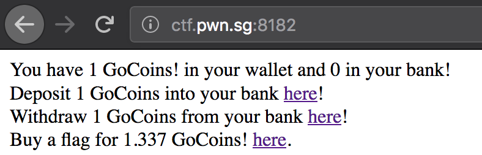
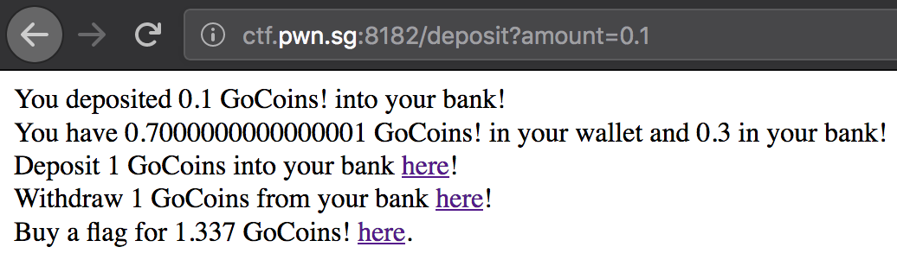
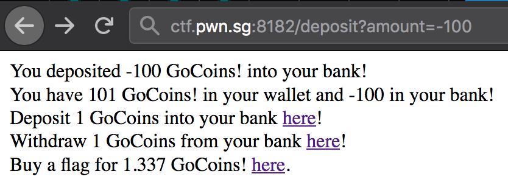

# CrossCTF Finals 2018: GoCoin! (web)

> I thought blockchain was cool, so I made my own coin.
>
> http://ctf.pwn.sg:8182
>
> Creator - quanyang (@quanyang)

## Challenge

We are given a nice site, that emulates a wallet. 

Clicking on deposit and withdraw goes to `/deposit?amount=1` and `/withdraw?amount=1` respectively. Instincts are to see if you can input other amounts. 

Messing around, we figured out that if you keep adding 0.01 coins, you'll encounter some nice floating point math quirks. (Doesn't it remind you of [Computer Organisation](https://nusmods.com/modules/CS2100/computer-organisation) lessons?)

If you continue until you have 0.35000000000000003 coins, then start adding 0.005 coins, you can fill your bank while having 0.35000000000000003 coins in your wallet! 

I'm not gonna go into floating point operations and stop here. Must have been some [rounding errors!](https://github.com/NUSGreyhats/crossctf-2018-challenges/blob/master/finals/challenges/GoCoin!/service/src/main.go#L110-L113)

## Alternative exploit

Yes, I actually missed this exploit that I only realised in [GoCoin! Plus](../gocoinplus/). You could simply specify negative amounts because it missed out negative checks:

