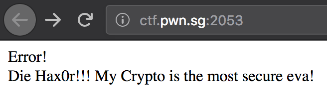
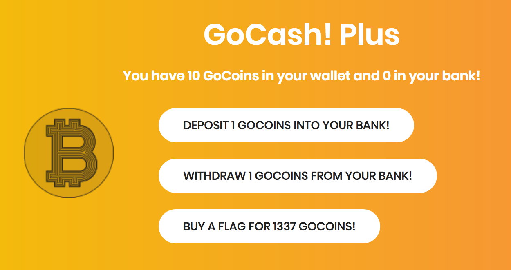
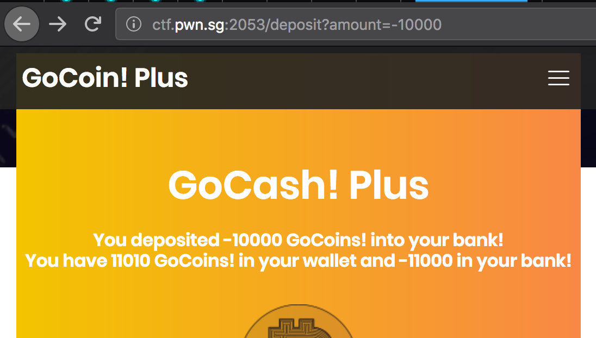

# CrossCTF Finals 2018: GoCoin! Plus (web)

> I thought blockchain was cool, so I made my own coin.
> 
> GoCoin! Plus is the forked and improved version of GoCoin!.
> 
> Update: I've improved it! More secures and with real cryptos, it's a true cryptocoin now!
> 
> http://ctf.pwn.sg:2053

## Challenge

Okay, the organisers made a mistake in this one. See [GoCoin! Plus Plus](../gocoinplusplus/README.md) for the real solution. 

So, a nice webpage. The first time you load it you get a nice message meant for you:

Here's the page you get to after a refresh.

The public key gave us a hint. Does it have something to do with crypto?

Similar to the previous challenge, it's got the same buttons with the same URL. Just wrapped in a fancier page. 

When we looked at the source provided, we first noticed it used JWT. However, before looking for implementation flaws, we noticed the flaw we didn't notice in the previous challenge: There was no check for the amount entered being less than 0. So we exploited it right away. 

